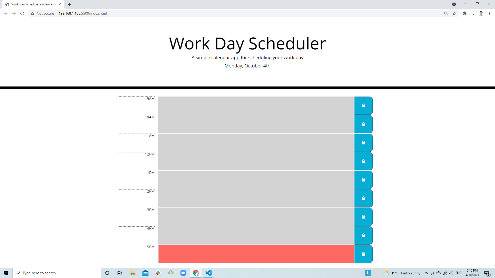

<h1 align="center"> WORK DAY SCHEDULER 🚩</h1>
<br>
<p align="center">
  <p align="center">
  <a href="#">
  
  <a href="#">
  
  <a href="#">
  
  <a href="#">
  
  <a href="#">
  
  <a href="#">
  
  <br>
  <a href="https://www.buymeacoffee.com/adampham123">
  
  <a href="#">
  
  <a href="#">
  
  <a href="https://github.com/ThiHoangPham/day-planner/blob/main/LICENSE">
  
  </a>
  <a href="#">
  
  <a href="#">
  
  </a>
  <a href="#">
  
  </a>
  <a href="#">
  
  </a>
  <a href="#">
  
  </a>
</p>
<hr>

  <h3 align="center">
    <p align="center">
      <a href="https://github.com/ThiHoangPham/day-planner"><strong>Explore the docs »</strong></a>
      <br />
      <br />
      <a href="https://thihoangpham.github.io/day-planner/">Demo</a>
      ·
      <a href="https://github.com/ThiHoangPham/day-planner/issues">Report Bug</a>
      ·
      <a href="https://github.com/ThiHoangPham/day-planner/issues">Request Feature</a>
    </p>
  </table>

  <details>
    <summary>Table of Contents</summary>
    <ul>
      <li><a href="#about-the-project">About The Project</a>
      <li><a href="#user-story">User Story</a></li>
      <li><a href="#acceptance-criteria">Acceptance Criteria</a></li>
      <li><a href="#live-demo-github">Live Demo</a></li>
      <li><a href="#contributor">Contributor</a></li>
      <li><a href="#contribution">Contribution</a></li>
      <li><a href="#license">License</a></li>
      <li><a href="#more-about-me">More About Me</a></li>
    </ul>
  </details>

  <br />

# About The Project
  A simple calendar application that allows a user to save events for each hour of the day by modifying starter code. This app will run in the browser and feature dynamically updated HTML and CSS powered by jQuery.

  

# User Story
```
AS AN employee with a busy schedule
I WANT to add important events to a daily planner
SO THAT I can manage my time effectively
```

# Acceptance Criteria
```
GIVEN I am using a daily planner to create a schedule
WHEN I open the planner
THEN the current day is displayed at the top of the calendar
WHEN I scroll down
THEN I am presented with timeblocks for standard business hours
WHEN I view the timeblocks for that day
THEN each timeblock is color coded to indicate whether it is in the past, present, or future
WHEN I click into a timeblock
THEN I can enter an event
WHEN I click the save button for that timeblock
THEN the text for that event is saved in local storage
WHEN I refresh the page
THEN the saved events persist
```

# Live Demo Github: 
<a href="https://thihoangpham.github.io/day-planner/">
  
  </a>

# Contributor
<a href="https://github.com/ThiHoangPham/day-planner">
  
  </a>

# Contribution
This how you can contribute to this project:
```
> Clone the project to your local 
> Create your own branch
> Add contribution codes/commit/push to remote repo
> Create a pull request
```
# License
  Distributed under the [MIT License](https://github.com/ThiHoangPham/day-planner/blob/main/LICENSE)

# More About Me
  <a href="https://github.com/ThiHoangPham">
  
  <a href="https://thihoangpham.github.io/react-portfolio/">
  
  <a href="https://www.linkedin.com/in/thaihoangpham/">
  
  <a href="mailto:thaihoangpham2008@gmail.com">
  
  </br>
  <p align ="right"><a href="#">↥ back to top</a></p>

- - -

© 2021 Hoang Thai Pham(Adam): Third-Party APIs - Work Day Scheduler
